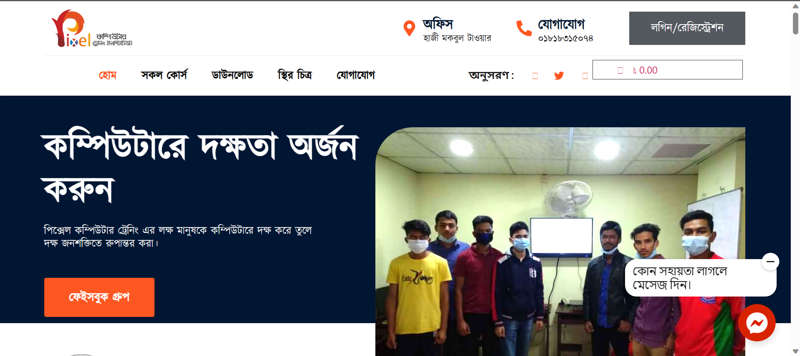

# LMS Website

This repository contains all the necessary files and database needed to set up a fully functional Learning Management System (LMS) website built with WordPress.



## Project Overview

The project is a Learning Management System (LMS) built using WordPress, Tutor LMS, and WooCommerce. The website allows users to manage online courses, users, and payments seamlessly using these powerful plugins.

## Built With

- **WordPress**: A popular content management system.
- **Tutor LMS**: A WordPress LMS plugin for creating and managing courses.
- **WooCommerce**: An e-commerce plugin for managing payments and product listings.

## Installation Instructions

To set up the WordPress site on your local or server environment, follow the steps below:

### Prerequisites

- XAMPP/WAMP/MAMP installed for local development or hosting server with cPanel access.
- Basic knowledge of WordPress and databases.

### Installation Steps

1. **Download the Repository**
   - Clone or download this repository to your local system.

2. **Create a MySQL Database**
   - Access your cPanel or use tools like phpMyAdmin to create a new MySQL database.
   - Create a new MySQL database user and assign it to the database with all privileges.

3. **Import the Database**
   - Go to the `database/` folder and find the SQL file (`wordpress_dump.sql`).
   - Import this SQL file into your newly created MySQL database using phpMyAdmin.

4. **Upload WordPress Files**
   - Place the downloaded files in your desired directory (e.g., `htdocs` if using XAMPP).

5. **Update Database References**
   - Use phpMyAdmin to navigate to your WordPress database.
   - Locate the `wp_options` table.
   - Find entries containing the old site URL (e.g., `siteurl` and `home`) and update them to match your new domain or localhost URL.

6. **Update wp-config.php**
   - Edit the `wp-config.php` file to match your database credentials:
     ```php
     define('DB_NAME', 'your_database_name');
     define('DB_USER', 'your_database_user');
     define('DB_PASSWORD', 'your_database_password');
     define('DB_HOST', 'localhost');
     ```

7. **Visit Your Website**
   - Open your browser and navigate to `http://localhost/your-folder-name` to see the WordPress site running.

## Project Structure

```
├── database/
│   └── wordpress_dump.sql
├── wp-content/
│   ├── plugins/
│   ├── themes/
│   └── uploads/
├── wp-config.php
├── index.php
└── other WordPress core files...
```

- **database/wordpress_dump.sql**: Contains the SQL file for importing the database.
- **wp-content/**: Directory containing plugins, themes, and uploads.
- **wp-config.php**: Configuration file for WordPress, contains database connection details.

## License

This project is open source and available under the [MIT License](LICENSE).

## Contributing

Contributions are welcome! If you have improvements or suggestions, feel free to submit an issue or a pull request.

## Contact

If you have any questions or need help setting up the site, feel free to reach out:

- **Email**: [your-email@example.com](mailto:your-email@example.com)
- **GitHub**: [Your GitHub Profile](https://github.com/your-profile)

---
Thank you for using this LMS website! Feel free to clone, fork, and contribute to improve the experience further.
